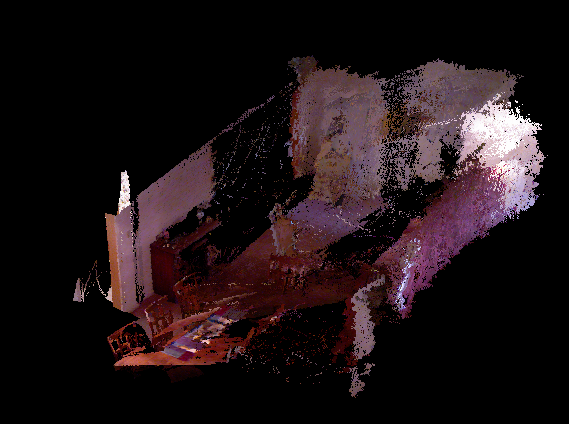
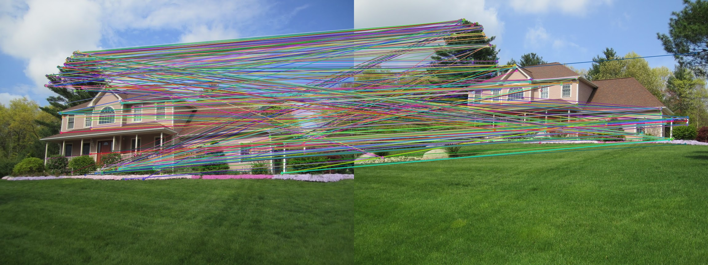
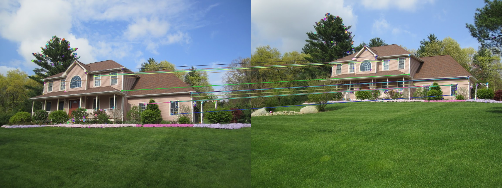

# SLAM-Notes

Some notes of [視覺 SLAM 十四講](https://www.tenlong.com.tw/products/9787121311048).

Author's repo: https://github.com/gaoxiang12/slambook.

## Environments

Ubuntu 16.04

OpenCV 3.x

CMake 3.5.1

Other libs are listed in the description of each example.

## Examples

### 01-CMake Basic

An example which uses **CMake** to create the makefile of an application. The executable file links the library of **OpenCV** to show an image. 

Create a build directory which is used to save the Makefile, share lib, etc.

    mkdir build
    cd build
 
 Config and build:

    cmake ..
    make

!! The examples below always need to follow the steps mentioned above to build.

### 02-Eigen

Install the lib of eigen3:

    sudo apt install libeigen3-dev

The example shows how to use **eigen3** to sovle the matrix equation.

### 03-PointCloud

Reconstruct the point cloud form **RGBD** images.

Install pcl:

    sudo add-apt-repository ppa:v-launchpad-jochen-sprickerhof-de/pcl
    sudo apt-get update
    sudo apt-get install libpcl-dev pcl-tools
    sudo apt-get install libproj-dev

[libvtkproj4.so not found](https://github.com/PointCloudLibrary/pcl/issues/1594):

    ln -s /usr/lib/x86_64-linux-gnu/libvtkCommonCore-6.2.so /usr/lib/libvtkproj4.so

Visualize the point cloud with pcl-tools:

    pcl_viewer map.pcd

The image above shows the reconstruction of the point cloud.

### 04-FeaturePointMatching

Use **ORB (Oriented FAST and Rotated BRIEF)** to find the similarity between two images.

ORB is basically a fusion of **FAST keypoint detector** and **BRIEF descriptor** with many modifications to enhance the performance.

<table>
    <tr>
        <td></td>
    </tr>
    <tr>
        <td></td>
    </tr>
</table>

The above figures shows the matches of the feature points. The figure at the top shows all matching feature points between two images. The figure at the bottom filters the pairs with low similarity.

### 05-Optimization

#### ceres_curve_fitting

See the [document of ceres](http://ceres-solver.org/installation.html) for more information.

### 06-PoseEstimation

#### pose_estimation_2d2d.cpp

Estimate the pose through two RGB images.

#### pose_estimation_3d2d.cpp

[How to install g2o](https://github.com/RainerKuemmerle/g2o)

[g2o理解及实践代码报错解决方法](https://blog.csdn.net/try_again_later/article/details/82585025)

#### triangulation.cpp

Compute the position obsered from camera1.
